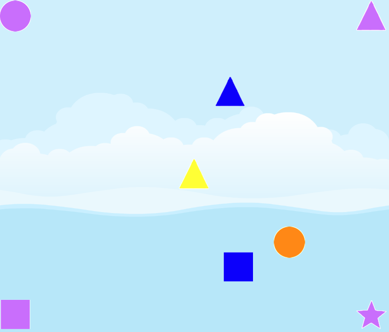

# Kids Game Prototype

## What is this?
This is a simple JavaScript game using Phaser 3. My goal with this game is to see if I could make something fun my kids can play with.

## Game mechanic
Four shapes are rendered at the corners of the screen.
A random number of these four shapes are also rendered in the middle of the screen. The player can now press and hold a shape from the middle and drag it to a corresponding shape in the corner. Once the shapes intersects, a sound plays and the dragged shape dissapears. Once the player has moved all shapes from the middle succesfully, a different "celebration" sound is played and new set of shapes if generated, allowing replay.

### This game is designed with the following assumptions:
- Sounds and visuals are important as they provide audible confirmation of any action the child performs. These should be bright and clear. (optionally animated)
- Children will find it easier using a touch screen device VS a PC that require mouse control skills
- The game requires a repeateable and rewarding mechanic. Unlike games for older audiences, it does not require specific goals. e.g. completing a level in (x) time.

## Issues
- Game launches directly from `index.html`.
- CORS prevents any assest from being loaded
- Strech to fill screen behavior renders shapes inconsistently. (far appart, on top of each other)
- Shapes render out partially of bounds on mobile devices
